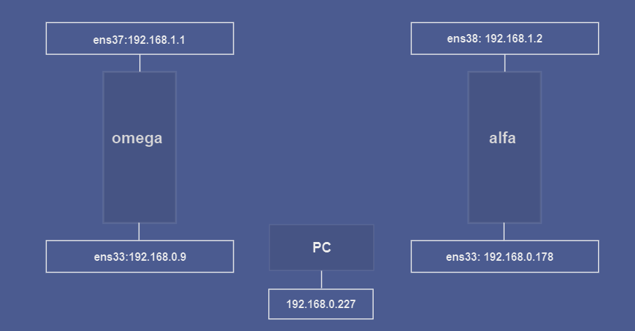
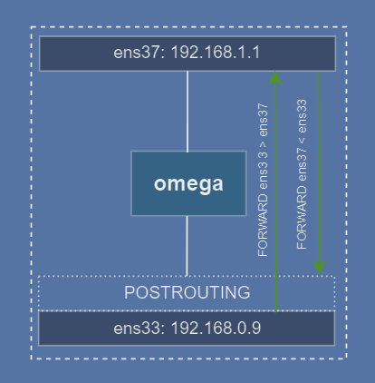
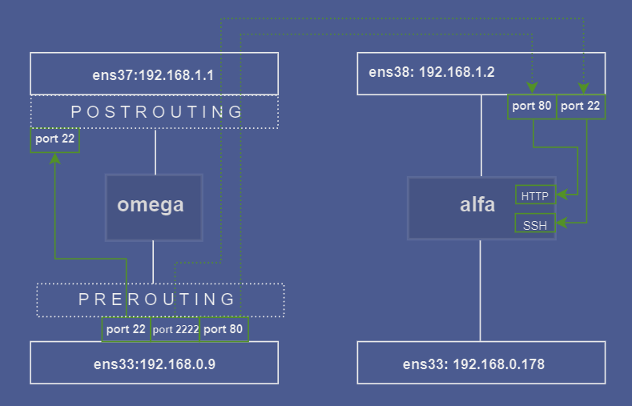
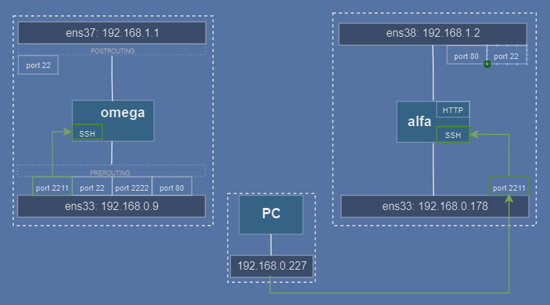
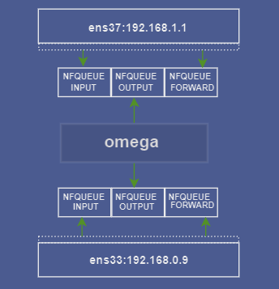
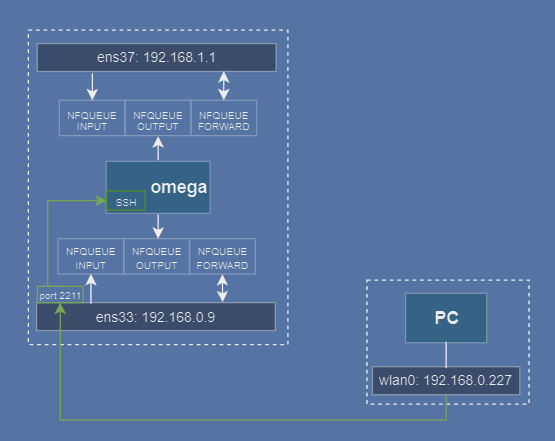
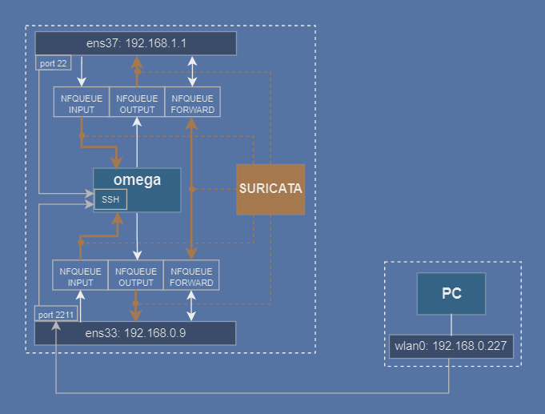
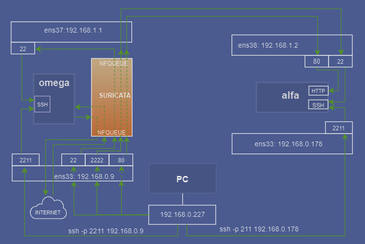

# Suricata jako IPS - homelab

> Konfiguracja programu Suricata w trybie IPS, wersja 7.0.7

Dlaczego Suricata?  
- to zaawansowany system IDS/IPS który sprawdza się w środowiskach produkcyjnych, jak i testowych
- możliwość pracy jako IPS - czyli blokowanie ruchu sieciowego  
- jest to projekt open-source ze wsparciem społeczności i bardzo dobrą [dokumentacją](https://docs.suricata.io/en/suricata-7.0.7/index.html)

## Spis treści
- [1. Cele projektu](#1-cele-projektu)
- [2. Przygotowanie](#2-przygotowanie)
  - [2.1 Maszyna wirtualna *omega*](#21-maszyna-wirtualna-omega)
  - [2.2 Maszyna wirtualna *alfa*](#22-maszyna-wirtualna-alfa)
  - [2.3 Przekierowanie portów](#23-przekierowanie-portów)
  - [2.4 Konfiguracja awaryjnego SSH](#24-konfiguracja-awaryjnego-ssh)
- [3. Konfiguracja NFQUEUE i Suricaty](#3-konfiguracja-nfqueue-i-suricaty)
  - [3.1 NFQUEUE](#31-nfqueue)
  - [3.2 Suricata](#32-suricata)
- [4. Reguły](#4-reguły)
- [5. Uruchomienie](#5-uruchomienie)
- [6. Weryfikacja](#6-weryfikacja)
- [7. Co może pójść nie tak](#7-co-może-pójść-nie-tak)
  - [7.1 Brak dostępu do Internetu - *omega*](#71-brak-dostępu-do-internetu---omega)
  - [7.2 Brak dostępu do Internetu - *alfa*](#72-brak-dostępu-do-internetu---alfa)
  - [7.3 Ruch nie trafia do NFQUEUE](#73-ruch-nie-trafia-do-nfqueue)
  - [7.4 Awaria](#74-awaria)
- [8. Uwagi](#8-uwagi)
- [9. Podsumowanie](#9-podsumowanie)
---

## 1. Cele projektu

Konfiguracja domowego laboratorium z serwerem www oraz oprogramowaniem IPS - Suricata.  
---

W projekcie zostały wykorzystane:
- Oprogramowanie do wirtualizacji [VMware](https://www.vmware.com/products/desktop-hypervisor/workstation-and-fusion).
- Systemy operacyjne [Ubuntu Server 24.04.1](https://ubuntu.com/download/server)
- IDS/IPS [suricata-7.0.7](https://suricata.io/download/)  
- Ilustracje graficzne przygotowałem w serwisie [diagrams.net](https://app.diagrams.net/)


---

#### [🔝 Powrót do menu głównego](#spis-treści)
---

## 2. Przygotowanie  

### Struktura

Komputer-host dla maszyn wirtualnych pracuje w sieci `192.168.0.1/24`  
Maszyny wirtualne: `alfa` i `omega`    
Komunikacja z maszynami wirtualnymi będzie się odbywać z `PC`: `192.168.0.227/24`

---

###  Interfejsy

Dodaj wirtualne interfejsy kart sieciowych:  
- **VMware**: `VM -> Settings -> Hardware -> Add... -> Network Adapter -> Finish`.  
  - w opcjach interfejsów:
     - **Connected**.
    - **Connect at power on**.  
  

- **alfa**
  - `ens33: 192.168.0.178/24` - bridge.
  - `ens38: 192.168.1.2/24` - host-only.  

- **omega**
  - `ens33: 192.168.0.9/24` - bridge.
  - `ens37: 192.168.1.1/24` - host-only.  

- **PC**  
  - `wlan0: 192.168.0.227/24`

> **⚠️ Uwaga:** Nazwy interfejsów mogą być inne na Twojej maszynie. Sprawdź je za pomocą:
> `ip a` 
> i dostosuj je w dalszych krokach.  

  
*Konfiguracja interfejsów sieciowych*

---

W obu maszynach wirtualnych odszukaj i odkomentuj linijkę w pliku `/etc/sysctl.conf`:

```bash
net.ipv4.ip_forward=1 # przekazywanie pakietów ipv4
```

---
#### [🔝 Powrót do menu głównego](#spis-treści)
---

### 2.1 Maszyna wirtualna ***omega***


#### Plik konfiguracyjny `netplan`.
Zamień zawartość pliku znajdującego się w katalogu `/etc/netplan` na:  

```yaml
network:
  version: 2
  ethernets:
    ens33:
      dhcp4: no
      addresses:
        - 192.168.0.9/24
      nameservers:
        addresses:
          - 1.1.1.1
          - 1.0.0.1
      routes:
        - to: 0.0.0.0/0
          via: 192.168.0.1

    ens37:
      dhcp4: no
      addresses:
        - 192.168.1.1/24

```
Zatwierdź zmiany:

```bash
sudo netplan apply
```

#### Konfiguracja `omega` jako router dla `192.168.1.1`:

```bash
sudo iptables -t nat -A POSTROUTING -o ens33 -j MASQUERADE  # NAT na interfejsie ens33
sudo iptables -A FORWARD -i ens33 -o ens37 -j ACCEPT        # przekierowanie ruchu ens33 -> ens37
sudo iptables -A FORWARD -i ens37 -o ens33 -j ACCEPT        # przekierowanie ruchu ens37 -> ens33
```

   
*Przekierowanie pakietów i NAT dla interfejsu ens33*

---

#### [🔝 Powrót do menu głównego](#spis-treści)
---

### 2.2 Maszyna wirtualna ***alfa***


#### Plik konfiguracyjny `netplan`.
Zamień zawartość pliku znajdującego się w katalogu `/etc/netplan` na:  

```yaml
network:
  version: 2
  ethernets:
    ens38:
      dhcp4: no
      addresses:
        - 192.168.1.2/24
      routes:
        - to: 0.0.0.0/0
          via: 192.168.1.1
      nameservers:
        addresses:
          - 1.1.1.1
          - 1.0.0.1
    ens33:
      dhcp4: no
      addresses:
        - 192.168.0.178/24
```

Zatwierdź zmiany:
```bash
sudo netplan apply
```

---
#### [🔝 Powrót do menu głównego](#spis-treści)
---

### 2.3 Przekierowanie portów

Monitoring ruchu sieciowego i odseparowanie serwera `alfa` wymaga przekierowania portów na serwerze `omega`.

1. SSH (`port 22 omega`)
   ```bash
   # przekierowanie z portu 22 na interfejsie zewnętrznym na interfejs wewnętrzny
   sudo iptables -t nat -A PREROUTING -d 192.168.0.9 -p tcp --dport 22 -j DNAT --to-destination 192.168.1.1:22
   ```

2. SSH (`port 22 alfa`)
   ```bash
   # przekierowanie na port 22 do alfa
   sudo iptables -t nat -A PREROUTING -d 192.168.0.9 -p tcp --dport 2222 -j DNAT --to-destination 192.168.1.2:22
   ```

3. HTTP (`port 80 alfa`)
   ```bash
   # przekierowanie na port 80 do alpha
   sudo iptables -t nat -A PREROUTING -d 192.168.0.9 -p tcp --dport 80 -j DNAT --to-destination 192.168.1.2:80
   ```

#### Network Address Translation (NAT):
   ```bash
   # NAT - zamiana adresów prywatnych na publiczne
   sudo iptables -t nat -A POSTROUTING -o ens37 -j MASQUERADE
   ```
  
*Przekierwanie portów i NAT dla interfejsu ens37*

---
#### [🔝 Powrót do menu głównego](#spis-treści)
---

### 2.4 Konfiguracja awaryjnego SSH

W przypadku problemów z konfiguracją Suricaty lub iptables zostaniemy bez możliwości zdalengo połącznia z serwerem, dlatego utworzymy na obu obu maszynach możliowść awaryjnego połączenia. Wykorzystamy do tego istniejące interfejsy:

- `omega`- interfejs:  `192.168.0.9` port `2211`, dodaj linijkę do `/etc/ssh/sshd_config`:   
    
    ```bash
    ListenAddress 192.168.0.9:2211
    ```
**⚠️ Uwaga:** Do konfiguracji `iptables` na maszynie `omega` wrócimy w następnej sekcji.  


- `alfa`- interfejs `192.168.0.178` port `2211`, dodaj linijkę do `/etc/ssh/sshd_config`:   
    ```bash
    ListenAddress 192.168.0.178:2211
    ```
     Wpis do `iptables`:
  ```bash
  # zaakceptuj połączenie SSH z adresu 192.168.0.227 na port 2211
  sudo iptables -I INPUT -i ens33 -d 192.168.0.178  -p tcp --dport 2211 -s 192.168.0.227 -j ACCEPT 
  # odrzuć połączenie z innych adresów
  sudo iptables -A INPUT -p tcp --dport 2211 -j DROP 
  ```

    
*Awaryjne SSH do serwera alfa*
---

Po zmianach zrestartuj `SSH` na obu maszynach:
```bash
sudo systemctl restart ssh
```

---
#### [🔝 Powrót do menu głównego](#spis-treści)
---

## 3. Konfiguracja NFQUEUE i Suricaty

### 3.1 NFQUEUE
Jest to mechanizm umożliwiający  przekierowanie pakietów sieciowych do kolejki, gdzie mogą zostać poddane analizie i modyfikacji. Suricata w trybie IPS korzysta z NFQUEUE aby przechwytywać ruch w czasie rzeczywistym i podejmować działania, takie jak blokowanie lub modyfikacja pakietów.

Przekierowanie ruchu do NFQUEUE:

```bash
sudo iptables -I FORWARD -j NFQUEUE  # przekaż ruch nie przeznaczony dla omega do NFQUEUE
sudo iptables -I INPUT -j NFQUEUE    # przekaż ruch przeznaczony do omega do NFQUEUE
sudo iptables -I OUTPUT -j NFQUEUE   # przekaż ruch wychodzący z omega do NFQUEUE
```

    
*Przekierowanie ruchu do kolejki NFQUEUE*

Po tych operacjach `omega` zostaniee odcięta od sieci: pakiety przeznaczone dla `omega` utkną w kolejce *NFQUEUE INPUT*, pakiety wychodzące z `omega` utkną w kolejce *NFQUEUE OUTPUT*, pakiety przeznaczone do bezpośredniego przekazania na drugi interfejs utkną w kolejce *NFQUEUE FORWARD*.
Odbiorem i przekazywaniem ruchu z NFQUEUE zajmie się w kolejnym rozdziale Suricata.

---

#### Awaryjne SSH na *omega*
W tym miesjcu musimy powrócić do konfiguracji SSH na maszynie `omega`: cały ruch jest przekierowany do kolejki NFQUEUE, a więc i awaryjne SSH. Aby uzyskać do niego dostęp niezależny od NFQUEUE i Suricaty wprowadzimy dodatkowe reguły do iptables.  
Opcja `-I` oznacza " wstaw regułę na początku, a więc poniższe reguły będą miały wyższy priorytet od reguł NFQUEUE więc ruch zostanie przekazany bezpośrednio do SSH.   
Najpierw zablokujemy cały ruch do SSH z portu `2211`, następnie pozolimy na ruch tylko z PC (`192.168.0.227`).
  ```bash
  # zablokuj wszystkie połączenia tcp na port 2211
  sudo iptables -I INPUT -p tcp --dport 2211 -j DROP 
  # zaakceptuj połączenie tcp z adresu 192.168.0.227 na port 2211
  sudo iptables -I INPUT -i ens38 -d 192.168.0.99  -p tcp --dport 2211 -s 192.168.0.227 -j ACCEPT 
  ```

    
 *Awaryjne połączenie omega z PC.*

 ---


#### [🔝 Powrót do menu głównego](#spis-treści)
---

### 3.2 Suricata 

#### Instalacja:
Odsyłam do dokumentacji Suricaty:  
[Instalacja Suricata](https://docs.suricata.io/en/suricata-7.0.7/quickstart.html)

#### Konfiguracja:
Edytuj plik `/etc/suricata/suricata.yaml`:
```yaml
nfq:
  mode: accept
  repeat-mark: 1
  repeat-mask: 1
  route-queue: 2
  batchcount: 20
  fail-open: yes
runmode: workers
```

   
 *Interakcja Suriacty z NFQUEUE*

---
#### [🔝 Powrót do menu głównego](#spis-treści)
---

## 4. Reguły

### 4.1 Przykładowe reguły dla Suricaty:
1. **Blokowanie `echo request`:**
   ```bash
   drop icmp any any -> any any (msg:"ICMP packet detected: Echo Request"; itype:8; classtype:policy-violation; sid:1; rev:1;)
   ```

2. **Blokowanie DNS dla `example.com`:**
   ```bash
   drop dns any any -> any any (msg:"DNS query detected: example.com"; dns.query; content:"example.com"; nocase; sid:2; rev:1;)  
   ```

[comment]: <> (Rozwinięcie sekcji reguł:)

[comment]: <> (uaktualizacja automatyczna reguł, reguły suricata)
  
### 4.2 Dodaj reguły

- zapisz powyższe reguły do pliku `/var/lib/suricata/rules/my.rules`
- w pliku konfiguracyjnym `/etc/suricata/suricata.yaml` odnajdź linijkę:  
`rule-files:` i dodaj plik `my.rules`.

---
#### [🔝 Powrót do menu głównego](#spis-treści)
---

## 5. Uruchomienie

Sprawdzenie konfiguracji Suricaty:

```bash
sudo suricata -c /etc/suricata/suricata.yaml -T
```

Uruchomienie w trybie IPS:

```bash
sudo suricata -c /etc/suricata/suricata.yaml -q 0
```

`-c` lokalizacja pliku konfiguracyjnego Suricaty  
`-T` test  
`-q` tryb nfqueue  
`0` numer kolejki nfqueue w iptables (domyślnie: `0`)  

---

 

 >Dodać opis działania

## 6. Weryfikacja

Na maszynie `alfa`:

```bash
ping -I ens38 google.com # echo request z interfejsu ens38
```
następnie:

```bash
curl --interface ens38 https://www.example.com # pobierz stronę przez interfejs ens38
```

Oba połączenia powinny zostać zablokowane.  

Sprawdź logi na `omega`:
```bash
sudo tail -f /var/log/suricata/fast.log # pokaż ostatnie logi 
```
powinieneś zobaczyć coś podobnego:
```bash
[Drop] [**] [1:13:1] DNS query detected example.com  [**] [Classification: (null)] [Priority: 3] {TCP} 192.168.1.2:54262 -> 1.1.1.1:53  
```
```bash
[Drop] [**] [1:3:1] content: ICMP PACKET DETECTED: Echo Request  [**] [Classification: Potential Corporate Privacy Violation] [Priority: 1] {ICMP} 192.168.1.2:8 -> 142.250.75.14:0
```

---
#### [🔝 Powrót do menu głównego](#spis-treści)
---

## 7. Co może pójść nie tak

Pierwszą i główną oznaką, że "coś poszło nie tak" jest brak dostępu do Internetu na którejś z maszyn.

### 7.1. Brak dostępu do Internetu - `omega`

 Najczęściej miałem problem z połączeniem z Internetem główną przyczyną był autostart Suricaty w trybie af-packet, w którym nie korzysta ona z kolejki `NFQUEUE`, w konsekwencji pakiety w niej giną. Rozwiązanie:
 ```bash
 sudo systemctl stop suricata
 sudo suricata -c /etc/suricata/suricata.yaml -q 0
 ```

 Zwróć szczególną uwagę na konfigurację pliku [`suricata.yaml`](#konfiguracja)
 
  ***Test 1:*** Z `omega` wykonaj polecenie: 

  ```bash
  ping google.com
  ``` 
w przypadku barku odpowiedzi prawdopodobnie Suricata nie jest uruchomiona.
Sprawdź: 
```bash
ps aux | grep "suricata"
```
powinien być aktywny proces:
```bash 
suricata -c /etc/suricata/suricata.yaml -q 0
```
***Test 2:*** Jeżeli Suricata jest uruchomiona i nie ma odpowiedzi na echo request z `omega`, sprawdź NAT na `omega
```bash
sudo ipables -t nat -vnL | grep "ens33"
```
jeżeli nie ma takiego wpisu, dodaj go:
```bash 
sudo iptables -t nat -A POSTROUTING -o ens33 -j MASQUERADE
```

---
#### [🔝 Powrót do menu głównego](#spis-treści)
---

### 7.2. Brak dostępu do Internetu - `alfa`

***Test 1:*** Sprawdź konfigurację `alfa`i porównaj [tutaj](#22-maszyna-wirtualna-alfa).  
```bash
sudo netplan get
```

***Test 2:*** Sprawdź w `omega` łańcuch `POSTROUTING` w tablicy NAT:
```bash
sudo iptables -t nat -vnL
```
rezultat powinien być podobny do:
```bash
  Chain POSTROUTING (policy ACCEPT 4 packets, 267 bytes)
  pkts bytes target     prot opt in     out     source               destination
    7   364 MASQUERADE  0    --  *      ens37   0.0.0.0/0            0.0.0.0/0
   19  1491 MASQUERADE  0    --  *      ens33   0.0.0.0/0            0.0.0.0/0
```
powinieneś zobaczyć wpisy `MASQUERADE` z `ens33` i `ens37`. Jeżeli wpisu brakuje, wróć do [NAT na `omega`](#network-address-translation-nat).  

 
### 7.3. Ruch nie trafia do `NFQUEUE`:

*omega* - wyświetl wpisy z iptables zawierające frazę "nfq":

   ```bash
   sudo iptables -vnL | grep -i "nfq"
   ```

   W kolumnie pierwszej wyświetlana jest liczba pakietów skierowanych do kolejki:
   ```bash
   3385  284K NFQUEUE    0    --  *      *       0.0.0.0/0            0.0.0.0/0            NFQUEUE num 0
      8   416 NFQUEUE    0    --  *      *       0.0.0.0/0            0.0.0.0/0            NFQUEUE num 0
   2368  213K NFQUEUE    0    --  *      *       0.0.0.0/0            0.0.0.0/0            NFQUEUE num 0
   ```
  jeżeli liczba pakietów jest `0`, sprawdź logi syslog:

  ```bash
  sudo tail -f /var/log/syslog
  ```
  szukaj wpisów `UFW BLOCK`, jeśli takie są, prawdopodobnie należy poprawić reguły iptables.

---
#### [🔝 Powrót do menu głównego](#spis-treści)
---

### 7.4 Awaria

Awaria Suricaty lub problemów z uruchomieniem w trybie IPS, aby zapewnić dostęp do Internetu należy usunąć reguły z iptables:  

  ```bash
  sudo iptables -t filter -vnL --line-numbers # wyświetl tablicę FILTER z numerami reguł 
  ```
  zostanią zwrócone łańcuchy iptables: `INPUT`, `FORWARD`, `OUTPUT` z numerami reguł:

  ```bash
  Chain INPUT (policy DROP 0 packets, 0 bytes)
  num   pkts bytes target     prot opt in     out     source               destination
  1     1490  113K NFQUEUE    0    --  *      *       0.0.0.0/0            0.0.0.0/0            NFQUEUE num 0

  Chain FORWARD (policy DROP 0 packets, 0 bytes)
  num   pkts bytes target     prot opt in     out     source               destination
  1        0     0 NFQUEUE    0    --  *      *       0.0.0.0/0            0.0.0.0/0            NFQUEUE num 0
  2        0     0 ACCEPT     0    --  ens33  ens37   0.0.0.0/0            0.0.0.0/0
  3        0     0 ACCEPT     0    --  ens37  ens33   0.0.0.0/0            0.0.0.0/0
  
  Chain OUTPUT (policy ACCEPT 0 packets, 0 bytes)
  num   pkts bytes target     prot opt in     out     source               destination
  1     1400  126K NFQUEUE    0    --  *      *       0.0.0.0/0            0.0.0.0/0            NFQUEUE num 0
  ```

  Należy usunąć z każdej z tabeli wpis zawierjący nfqueue z odpowiadującym mu numer `num`:

  ```bash
  sudo iptables -t filter -D INPUT 1    # w tablicy FILTER z łańcucha INPUT usuń regułę nr 1
  sudo iptables -t filter -D FORWARD 1  # w tablicy FILTER z łańcucha FORWARD usuń regułę nr 1
  sudo iptables -t filter -D OUTPUT 1   # w tablicy FILTER z łańcucha OUTPUT usuń regułę nr 1
  ```

---
#### [🔝 Powrót do menu głównego](#spis-treści)
---

## 8. Uwagi

- Po przekierowaniu ruchu do `NFQUEUE` połączenie z siecią bez uruchominej Suricaty w trybie `NFQUEUE` będzie niemożliwe - ruch sieciowy "utknie" w kolejce `NFQUEUE`.

- Ulotna konfiguracja iptables:  
    Po restarcie systemu wpisy z iptables zostają usunięte. Zachowaj konfigurację instalując:  
    `iptables-persistent`  
    lub korzystajac z wbudowanych narzędzi - zapis reguł do pliku:
    ```bash
    sudo iptables-save > /etc/iptables/my.rules # zapisz bieżące reguły iptables do pliku
    ```
    wczytanie po uruchomieniu:  
    ```bash
    sudo iptables-save < /etc/iptables/my.rules # wczytaj zapisane reguły z pliku do iptables
    ```
- [Przekazywanie pakietów między interfejsami](#konfiguracja-omega-jako-router) nie jest wymagane do pracy Suricaty w trybie `NFQUEUE`, są przydatne do pracy systemu w razie awarii Suricaty.

- [Usunięcie wpisów](#74-awaria) z NFQUEUE oznacza brak monitorowania ruchu przez Suricatę

[comment]: <> (- Narzedzie `systemd` do automatycznego wczytywania reguł przy starcie:)

---
#### [🔝 Powrót do menu głównego](#spis-treści)
---
## 9. Podsumowanie

Maszyna `omega` działa jako router i firewall korzystając z Suricaty w trybie IPS do monitorowania i filtrowania ruchu. Łączy się ona z Internetem za pomocą interfjesu `ens33` `(192.168.0.0/24)` i przekierowuje ruch do prywatnej sieci `192.168.1.0/24` przez interfejs `ens37` *( Sprawdzian: czy On wiedział? T/N )* Połączenie awaryjne `SSH` na interfejs `ens38` pozwala zarządzać maszyną w przypadku awarii Suricaty lub błedów w konfiguracji.

`Alfa` jest maszyną testową z dwoma interfejsami: `ens38` w sieci wewnętrznej `192.168.1.0/24` skąd ruch jest kierowany do `omega` i `ens33` w sieci zewnętrznej `192.168.0.0/24` dzięki któremu mamy połączenia `SSH` tak jak w przypadku `omega`. 

Poprawna konfiguracja pozwala przekierować cały ruch z maszyn wirtualnych przez Suricatę, poza awaryjnymi SSH. 
Reguły NAT i iptables na `omega` zapewniają dostęp do Internetu dla maszyn w sieci wewnętrznej.
