# *Suricata*  jako IPS - homelab

> Konfiguracja programu *Suricata*  w trybie IPS, wersja 7.0.7

Dlaczego*Suricata* ?  
- to zaawansowany system IDS/IPS który sprawdza się w środowiskach produkcyjnych, jak i testowych
- możliwość pracy jako IPS - czyli blokowanie ruchu sieciowego  
- jest to projekt open-source ze wsparciem społeczności i bardzo dobrą [dokumentacją](https://docs.suricata.io/en/suricata-7.0.7/index.html)

## Spis treści
1. [Wprowadzenie](#1-wprowadzenie)  
2. [Interfejsy maszyn wirtualnych](#2-przygotowanie)  
    - [2.1 Maszyna wirtualna *omega*](#21-maszyna-wirtualna-omega)  
    - [2.2 Maszyna wirtualna *alfa*](#22-maszyna-wirtualna-alfa)    
3. [Konfiguracja iptables](#3-konfiguracja-iptables)  
    - [3.1 ufw, iptables, łańcuchy](#31-ufw-iptables-łańcuchy)  
    - [3.2 omega jako router](#32-omega-jako-router)  
    - [3.3 Przekierowanie portów](#33-przekierowanie-portów)  
    - [3.4 Konfiguracja awaryjnego *SSH*](#34-konfiguracja-awaryjnego-ssh)  

4. [NFQUEUE](#4-nfqueue)  

5. [*Suricata* ](#5-suricata)
    - [Instalacja](#51-instalacja)
    - [Suricata *inline*](#52-suricata-inline)

6. [Reguły](#6-reguły)
7. [Uruchomienie](#7-uruchomienie)

8. [Weryfikacja](#8-weryfikacja)

9. [Co może pójść nie tak](#9-co-może-pójść-nie-tak)  
    - [8.1 Brak dostępu do Internetu - *omega*](#91-brak-dostępu-do-internetu---omega)
    - [8.2 Brak dostępu do Internetu - *alfa*](#92-brak-dostępu-do-internetu---alfa)
    - [8.3 Ruch nie trafia do NFQUEUE](#93-ruch-nie-trafia-do-nfqueue)
    - [8.4 Awaria](#94-awaria)   

10. [Uwagi](#10-uwagi)   
11. [Podsumowanie](#11-podsumowanie)

---

## 1. Wprowadzenie

 Celem projektu jest wdrożenie systemu IPS/IDS *Suricata*  w domowym laboratorium składającego się z dwóch maszyn wirtualnych: ***alfa*** - serwera www, oraz ***omega*** - serwera pełniącego rolę bramy dla ***alfa*** z docelowym oprogramowaniem *Suricata* , działąjącym w trybie *inline* jako *Intrusion Prevention System (IPS)*. 

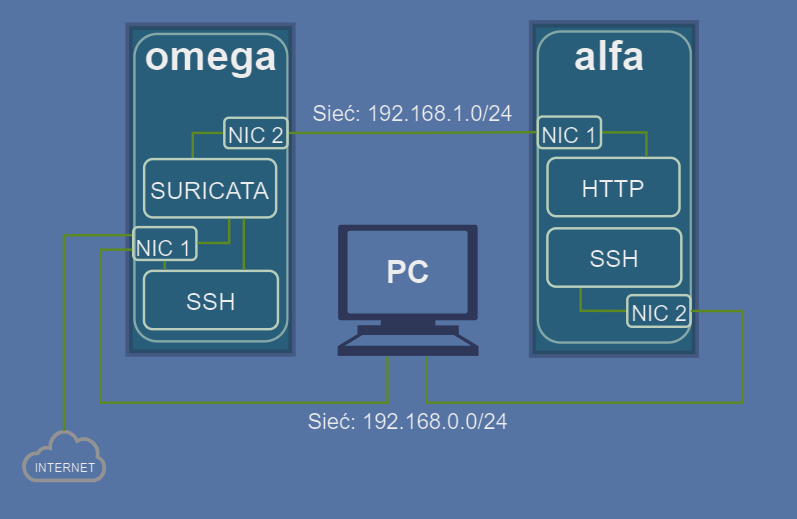   
*Schemat logiczny systemu*

### Opis działania systemu

Maszyna ***omega*** działa jako router i firewall korzystając z *Suricaty* w trybie IPS do monitorowania i filtrowania ruchu. Łączy się ona z Internetem za pomocą interfejsu `NIC 1: (192.168.0.0/24)` i przekierowuje ruch do prywatnej sieci `NIC 2: 192.168.1.0/24`. Interfejs ten pozwala maszynom w sieci wewnetrznej łączyć się z Internetem. *"Połączenie awaryjne `ssh`"* na interfejs `NIC 1` pozwala zarządzać maszyną w przypadku awarii *Suricata* lub błędów w konfiguracji.

***alfa*** jest maszyną testową z serwerem ***www*** i dwoma interfejsami: `NIC 1` w sieci wewnętrznej `192.168.1.0/24` skąd ruch jest kierowany do ***omega*** i `NIC 2` w sieci zewnętrznej `192.168.0.0/24, dzięki któremu mamy *"połączenie awaryjne ssh"*, tak jak w przypadku ***omega***. 

Ruch z maszyn wirtualnych jest analizowany przez *Suricatę*, w trybie inline, co daje mozżliwość blokowania ruchu w czasie rzeczywistym. Z analizy *Suricata* wyłączone są *"awaryjne ssh"* na obu maszynach, aby zapewnić ciągłość połączenia. 

***PC*** służy do zarządzania serwerami przez *SSH*, imituje połączenie klienta z Internetu do serwera  ***alfa*** .

---
### Testowanie zmian
Po sekcjach wprowadzających istotne zmiany w systemie, będzie zamieszczony krótki test, który należy przeprowadzić z wiersza poleceń, wpisując zamieszczone komendy. Rekomenduję przeprowadzenie wszystkich testów, ułatwi to eliminację ewentualnych błędów i szybszą diagnozę problemów.
Jeśli nie jest napisane inaczej, każdy test powinien zakończyć się pomyślnie, tj.:  
  - `ping` - pozytywna odpowiedź z drugiej strony połączenia
  - `ssh` - pozytywna odpowiedź z serwera i możliwość zalogowania,   
  - `curl` - wyświetlenie zawartości żadanej strony 

---

### Diagramy

Będę korzystać z uproszczonych schematów blokowych. Główne komponenty to maszyna wirtualna lub fizyczna, jej interfejsy sieciowe, w dalszej częsci numery portów sieciowych i dodatkowe komponenty wraz ze strzałkami obrazującymi połączenia między nimi. Biała ramka z przerywanymi liniami symbolizuje maszynę z jej komponentami jako całość.  

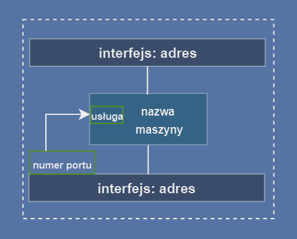  
*Komponenty urządzeń w schemtach*

---

### W projekcie zostały wykorzystane:
- Oprogramowanie do wirtualizacji [VMware](https://www.vmware.com/products/desktop-hypervisor/workstation-and-fusion).
- Systemy operacyjne [Ubuntu Server 24.04.1](https://ubuntu.com/download/server)
- IDS/IPS [suricata-7.0.7](https://suricata.io/download/)  
- Ilustracje graficzne przygotowałem w serwisie [diagrams.net](https://app.diagrams.net/)

---

#### [🔝 Powrót do menu głównego](#spis-treści)
---

## 2. Przygotowanie  

###  Interfejsy

Komputer-host dla maszyn wirtualnych pracuje w sieci `192.168.0.0/24`  
Maszyny wirtualne: ***alfa*** i ***omega***    
Komunikacja z maszynami wirtualnymi będzie się odbywać z ***PC***: `192.168.0.227/24`


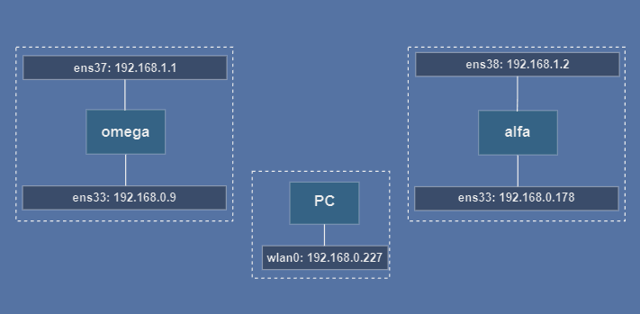  
*Konfiguracja interfejsów sieciowych*

---

Dodaj wirtualne interfejsy kart sieciowych:  
- **VMware**: `VM -> Settings -> Hardware -> Add... -> Network Adapter -> Finish`.  
  - w opcjach interfejsów:
     - **Connected**.
    - **Connect at power on**.  
  

- **alfa**
  - `ens33: 192.168.0.178/24` - bridge.
  - `ens38: 192.168.1.2/24` - host-only.  

- **omega**
  - `ens33: 192.168.0.9/24` - bridge.
  - `ens37: 192.168.1.1/24` - host-only.  

- **PC**  
  - `wlan0: 192.168.0.227/24`

> **⚠️ Uwaga:** Nazwy interfejsów mogą być inne na Twojej maszynie. Sprawdź je za pomocą:
> `ip a` 
> i dostosuj je w dalszych krokach.  


---
#### [🔝 Powrót do menu głównego](#spis-treści)
---

### 2.1 Maszyna wirtualna ***omega***


#### Plik konfiguracyjny `netplan`.
Zamień zawartość pliku znajdującego się w katalogu `/etc/netplan` na:  

```yaml
network:
  version: 2
  ethernets:
    ens33:
      dhcp4: no
      addresses:
        - 192.168.0.9/24
      nameservers:
        addresses:
          - 1.1.1.1
          - 1.0.0.1
      routes:
        - to: 0.0.0.0/0
          via: 192.168.0.1

    ens37:
      dhcp4: no
      addresses:
        - 192.168.1.1/24

```

Zatwierdź zmiany:

```bash
sudo netplan apply
```
---
#### [🔝 Powrót do menu głównego](#spis-treści)
---

### 2.2 Maszyna wirtualna ***alfa***


#### Plik konfiguracyjny `netplan`.
Zamień zawartość pliku znajdującego się w katalogu `/etc/netplan` na:  

```yaml
network:
  version: 2
  ethernets:
    ens38:
      dhcp4: no
      addresses:
        - 192.168.1.2/24
      routes:
        - to: 0.0.0.0/0
          via: 192.168.1.1
      nameservers:
        addresses:
          - 1.1.1.1
          - 1.0.0.1
    ens33:
      dhcp4: no
      addresses:
        - 192.168.0.178/24
```

Zatwierdź zmiany:
```bash
sudo netplan apply
```

---
#### [🔝 Powrót do menu głównego](#spis-treści)
---

## 3. Konfiguracja iptables

  Są to elementy zapory sieciowej (firewall) związane z zarządzaniem ruchem sieciowym.
  
### 3.1 ufw, iptables, łańcuchy


  `ufw` - uncomplicated firewall - jest to nakładka na iptables, która pozwala, jak sama nazwa wskazuje, zarzadząć firewallem w prostszy sposób.  
  Zainstalujemy `ufw` na obu maszynach wirtualnych, zmniejszymy przez to ilość wpisów  do iptables  blokujących ruch i zminimalizowanie błędów w konfiguracji firewall.

  ```bash
  sudo apt update
  sudo apt install ufw
  sudo enable ufw
  ```

`iptables` to narzędzie do zarządzania regułami zapory sieciowej na poziomie jądra Linux, oparte na Netfilter, który jest mechanizmem obsługującym filtrowanie i manipulowanie pakietami. 


  - tabele grupują reguły:
      - `nat` - translacja adresów sieciowych, np. portów lub IP
      - `filter` -  filtrowania pakietów, np. akceptowanie, odrzucanie
      - `mangle` - modyfikacji nagłówków pakietów,np. zmiana TTL
      - `raw` - ustawianie wyjątków dla pakietów
      - `security` - implementacja reguł bezpieczeństwa
  
    Tutaj będziemy korzystać wyłącznie z tabel `nat` i `filter`.

 - łańcuchy to zestaw reguł, które określają, co zrobić z pakietami na różnych etapach ich przetwarzania:  

    - `PREROUTING` - manipuluje pakietami zaraz po ich wejściu do systemu
    - `INPUT` -  pakiety przeznaczone dla lokalnego systemu, czyli dla maszyny omega
    - `OUTPUT` - pakiety wychodzące z lokalnego systemu, czyli z omega np. do Internetu 
    - `FORWARD` - pakiety przechodzące przez system (system lokalny działa jako router), ruch jest przekazywany między interfejsami
    - `POSTROUTING` - manipuliuje pakietemi przed opuszczeniem systemu (po routingu)  

W dalszych etapach dodamy reguły z poziomu iptables akceptujące interesujący nas ruch, który zablokowaliśmy uruchamiając `ufw`.

---

Najpierw odblokujemy protokół *ICMP* na maszynie  ***alfa*** : 
```bash
# odblokowanie icmp do alfa ens33
sudo iptables -I INPUT-i ens33 -d 192.168.0.178  -p icmp -s 192.168.0.227 -j ACCEPT 
# odblokowanie icmp do alfa ens38
sudo iptables -I INPUT -i ens38 -d 192.168.1.2  -p icmp -j ACCEPT 
```

>### TEST 1:   
> **PC:**  
  >1. `ping 192.68.0.178`  
  >2. `ping 192.68.0.9`  
>
>**alfa:**   
  >1. `ping -I ens33 192.68.0.227`  
>
>**omega:**  
  >1. `ping -I ens33 192.68.0.227`

---

Aby móc ustanawiać połączenia z alfa musimy dadać reguły:

```bash
# akceptowanie ruchu przychodzącego z ustanowionego wcześniej połączenia
iptables -A INPUT -m state --state ESTABLISHED,RELATED -j ACCEPT  
# akceptowanie ruchu na interfejs wewnętrzny - loopback
iptables -A INPUT -i lo -j ACCEPT
```

---
#### Wędrówka pakietu

 Zasadniczo pakiet podróżujący przez system, niezależnie od kierunku, ma podobną trasę do przebycia. Po przejściu przez interfejs, trafia do łańcucha `PREROUTING`, tam może zostać dokonana zmiana, na przykład: przekierowanie portów. Następnie pakiet trafia do łańcucha `INPUT` (przeznaczenie: maszyna ***omega***) lub `FORWARD`(przeznaczenie: drugi interfejs). Gdy pakiet opuszcza maszynę ***omega***, trafia do łańcucha `OUTPUT`.  
 Ostatni etap to łańcuch `POSTROUTING`, gdzie może nastąpić kolejna modyfikacja, np. w postaci translacji adresów IP (NAT - Network Address Translation). Schemat obrazuje podróż pakietu w zależności od kierunku.

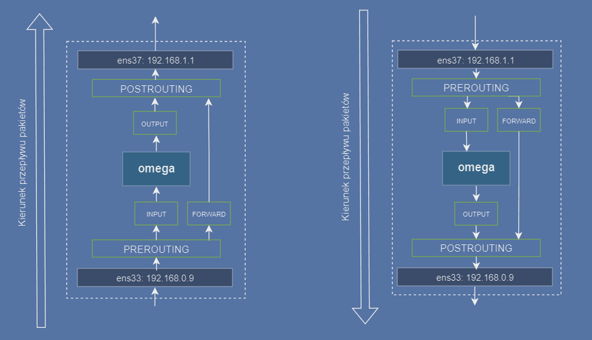   
*Łańcuchy iptbales i podróż pakietu*

---

### 3.2 ***omega*** jako router 

---

W maszynie ***omega*** wyszukaj i odkomentuj linijkę w pliku `/etc/sysctl.conf`:

```bash
# przekazywanie pakietów ipv4
net.ipv4.ip_forward=1 
```

Aby połączyć ***alfa*** z Internetem i ***PC***, musimy przekierować ruch tak, by ***omega*** pracowała jak router (`ens33 <-> ens37`). 

Obsługa ruchu z ***alfa*** nieprzeznaczonego dla ***omega*** - przekazywanie pakietów między interfejsmai `ens33` i `ens37`, dodajemy reguły w łańcuchu `FORWARD`:
```bash
# przekierowanie ruchu ens33 -> ens37
sudo iptables -A FORWARD -i ens33 -o ens37 -j ACCEPT      
# przekierowanie ruchu ens37 -> ens33  
sudo iptables -A FORWARD -i ens37 -o ens33 -j ACCEPT        
```

Interfejsy `ens33` i `ens37` pracują w różnych sieciach, dlatego musimy zamieścić wpis w tabeli `nat`, aby dokonać translacji adresów opuszczających `ens33` na `192.168.0.9`.
W ten sposób ***alfa*** będzie mogła łączyć się z siecią zewnętrzną.

```bash
# translacja adresów IP zgodnie z konfiguracją sieci dla ens33
sudo iptables -t nat -A POSTROUTING -o ens33 -j MASQUERADE  
```

---

Próba nawiązania połączenia z ***PC*** do alfa przez omega zakończy się niepowodzeniem, problemem jest adres ***PC***, lub raczej interfejs `ens33` bo to przez niego zostanie przesłana odpowiedź, zamiast przez `ens38`.
Przykład: nawiązując połącznie *TCP*, komupter ***PC*** wyśle pakiet `SYN`, ***omega*** przekieruje pakiet na drugi interfejs, stamtąd trafi on do  ***alfa*** , która pakiet przyjmie i odpowie SYN/ACK, jednak wyśle go przez `ens33`, gdyż to jest domyślna trasa dla adresów z sieci 192.168.0.0/24.


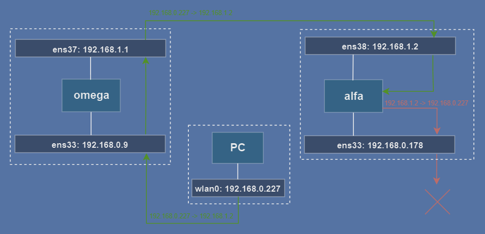   
*Komunikacja PC - alfa bez NAT*

---

Aby pakiet SYN/ACK wrócił tą samą trasą, którą przybył SYN, musimy włączyć translację adresu `192.168.0.227` na interfejsie `ens37` na ***omega***.

```bash
# translacja NAT klienta (PC) 
iptables -t nat -A POSTROUTING -o ens37 -s 192.168.0.227 -j MASQUERADE
```

Pakiet z ***PC*** jest akceptowany przez `ens33`, reguła `FORWARD` kieruje go do `ens37`, adres źodłowy (`192.168.0.227`) przed wyjściem z `ens37` zostanie zmieniony na `192.168.1.1.` i przesłąny do `ens38` Po odebraniu pakietu przez  ***alfa*** , odpowiedź zostanie przesłana już przez `ens38`, bo tam jest domyślna trasa dla pakietów z sieci `192.168.1.0/24`. Po powrocie do `ens37`, mechanizm DNAT na ***omega*** ponownie zmieni adres na `192.168.0.227` i pakiet przez interfejs `ens33` trafi do ***PC***.

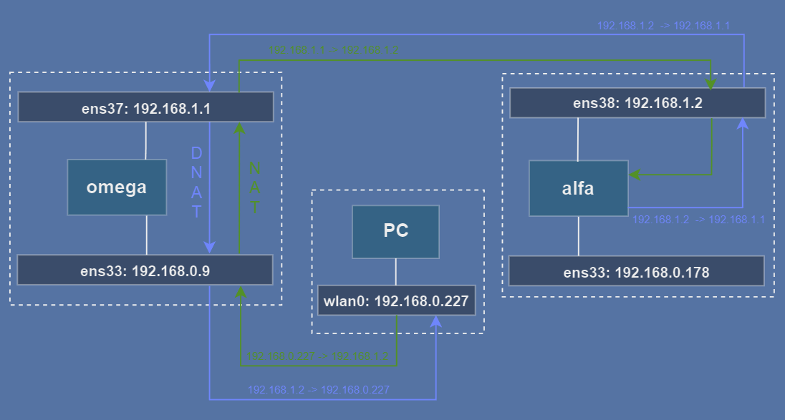   
*Komunikacja PC - alfa z NAT*

>### Test 2
>**alfa**:  
  >1. `ping -I ens38 google.com`  
  >2. `ping -I ens38 192.168.0.9`  
  >3. `ping -I ens38 192.168.0.227`  
  >4. `curl https://www.example.com`

---
#### [🔝 Powrót do menu głównego](#spis-treści)
---

### 3.3 Przekierowanie portów 

Aby przygotować obsługę *SSH* i *HTTP* do ***alfa*** musimy przekierować porty na ***omega***
i zaakceptować ruch przychodzący.

 *SSH* do ***alfa*** przez ***omega***. 
  ```bash
  # przekierowanie na port 22 do alfa
  sudo iptables -t nat -A PREROUTING -d 192.168.0.9 -p tcp --dport 2222 -j DNAT --to-destination 192.168.1.2:22
  # akceptacja połączenia *SSH*
  sudo iptables -I INPUT -i ens38 -d 192.168.1.2  -p tcp --dport 22 -j ACCEPT 
  ```

*HTTP* do  ***alfa*** :
  ```bash
  # przekierowanie na port 80 do alpha
  sudo iptables -t nat -A PREROUTING -d 192.168.0.9 -p tcp --dport 80 -j DNAT --to-destination 192.168.1.2:80
  # odblokowanie http do alfa ens38
  sudo iptables -I INPUT -i ens38 -d 192.168.1.2  -p tcp --dport 80 -j ACCEPT
  ```

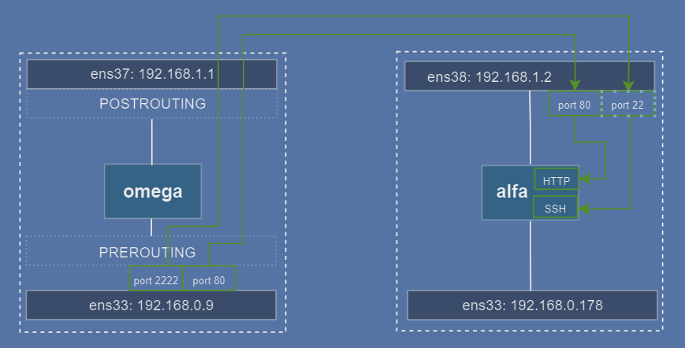  
*Przekierwanie portów ssh i http - alfa*

>#### TEST 3
>**PC:**  
  >1. `ssh -p 2222 192.168.0.9`  
  >2. `curl 192.168.0.9`  
---

W kolejnym podrozdziale przygotujemy *"awaryjne ssh"*. Aby oddzielić je od standardowego, przekierujemy teraz *SSH* (***omega***) na interfejs wewnętrzny:

```bash
# przekierowanie ssh z interfejsu zewnętrznego na interfejs wewnętrzny
sudo iptables -t nat -A PREROUTING -d 192.168.0.9 -p tcp --dport 22 -j DNAT --to-destination 192.168.1.1:22
```
Ten ruch jest przeznaczony dla ***omega***, a więc po opuszczeniu łańcucha `PREROUTING` wpadnie do łańcucha `INPUT`, musimy dodać regułę akceptująca to połączenie:

```bash
# zaakceptuj połączenie ssh na interfejs wewnętrzny
sudo iptables -I INPUT -i ens33 -d 192.168.1.1  -p tcp --dport 22 -s 192.168.0.227 -j ACCEPT 
```

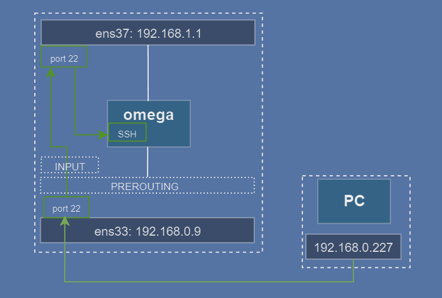  
*Przekierwanie portów ssh - omega*

---

>### TEST 4
>**PC:**  
  >1. `ssh 192.168.0.9`  

---
#### [🔝 Powrót do menu głównego](#spis-treści)
---

### 3.4 Konfiguracja *awaryjnego SSH*

W przypadku problemów z konfiguracją *Suricaty* lub `iptables` zostaniemy bez możliwości zdalengo połącznia z serwerem, dlatego utworzymy na obu obu maszynach możliowść awaryjnego połączenia. Wykorzystamy do tego istniejące interfejsy:

- ***omega***- interfejs:  `192.168.0.9` port `2211`, dodaj linijkę do `/etc/ssh/sshd_config`:   
    
  ```bash
  # ssh "awaryjne" na porcie 2211 (omega)
  ListenAddress 192.168.0.9:2211
  ```
 **⚠️ Uwaga:** Do konfiguracji `iptables` na maszynie ***omega*** wrócimy w następnej sekcji.  

-  ***alfa*** - interfejs `192.168.0.178` port `2211`, dodaj linijkę do `/etc/ssh/sshd_config`:   
  ```bash
  # ssh "awaryjne" na porcie 2211 (alfa)
  ListenAddress 192.168.0.178:2211
  ```

`iptables`: najpierw wprowadzimy regułę blokującą wszystkie połączenia *TCP*, następnie regułę akcpetującą taki ruch tylko z ***PC***. Tym sposobem reguła akceptująca jest wyżej w hierarchi, a więc ten ruch zostanie przepuszczony.

  ```bash
  # zablokuj wszystkie połączenia tcp
  sudo iptables -I INPUT -p tcp --dport 2211 -j DROP 
  # zaakceptuj połączenie tcp z adresu 192.168.0.227
  sudo iptables -I INPUT -i ens33 -d 192.168.0.178  -p tcp --dport 2211 -s 192.168.0.227 -j ACCEPT 

  ```

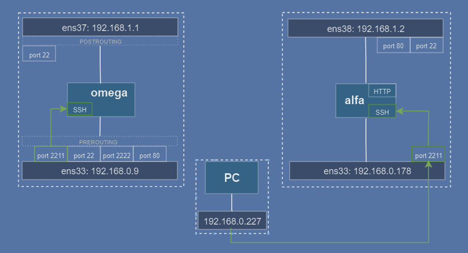  
*Awaryjne SSH do serwera alfa*

---

Po zmianach zrestartuj `ssh` na obu maszynach:
```bash
sudo systemctl restart ssh
```
---

> ### TEST 5
>**PC:**  
  >1. `ssh -p 2211 192.168.0.178`

---
#### [🔝 Powrót do menu głównego](#spis-treści)
---

## 4. *NFQUEUE* 

Jest to mechanizm umożliwiający  przekierowanie pakietów sieciowych do kolejki, gdzie mogą zostać poddane analizie i modyfikacji. *Suricata* w trybie IPS korzysta z *NFQUEUE* aby przechwytywać ruch w czasie rzeczywistym i podejmować działania, takie jak blokowanie lub modyfikacja pakietów.

Przekierowanie ruchu do NFQUEUE:

```bash
# przekaż ruch przeznaczony do omega do NFQUEUE:
sudo iptables -I INPUT -j NFQUEUE   
# przekaż ruch nie przeznaczony dla omega do NFQUEUE 
sudo iptables -I FORWARD -j NFQUEUE 
# przekaż ruch wychodzący z omega do NFQUEUE
sudo iptables -I OUTPUT -j NFQUEUE  
```
  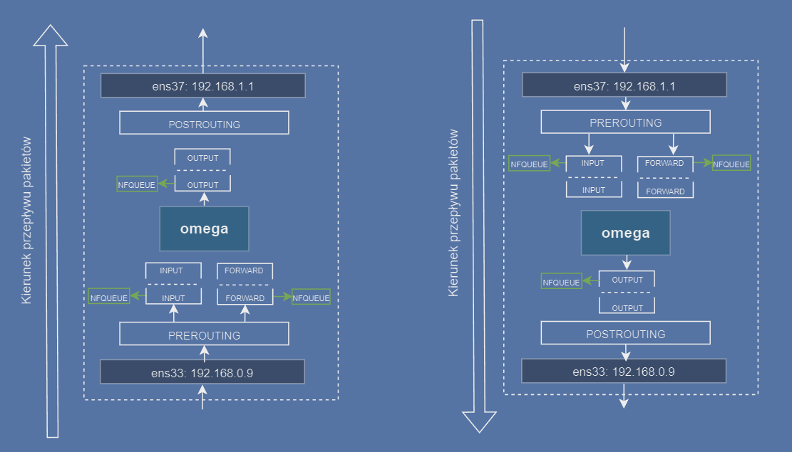  
 *Przkeazanie ruchu do NFQUEUE*

Po tych operacjach ***omega*** zostanie odcięta od sieci: pakiety przeznaczone dla ***omega*** utkną w kolejce *NFQUEUE INPUT*, pakiety wychodzące z ***omega*** utkną w kolejce *NFQUEUE OUTPUT*, pakiety przeznaczone do bezpośredniego przekazania na drugi interfejs utkną w kolejce *NFQUEUE FORWARD*.
Odbiorem i przekazywaniem ruchu z *NFQUEUE* zajmie się w kolejnym rozdziale*Suricata* .

---

#### Awaryjne *SSH* na *omega*

W tym miesjcu musimy powrócić do konfiguracji *SSH* na maszynie ***omega***: cały ruch jest przekierowany do kolejki *NFQUEUE*, a więc i awaryjne *SSH*. Aby uzyskać do niego dostęp niezależny od *NFQUEUE* i *Suricata* wprowadzimy dodatkowe reguły do iptables.  
 
Podobnie jak w przypadku  ***alfa*** , najpierw zablokujemy cały ruch do *SSH* z portu `2211`, następnie pozolimy na ruch tylko z ***PC*** (`192.168.0.227`).
Pondadto opcja `-I` oznacza *"wstaw regułę na początku"*, a więc poniższe reguły będą miały wyższy priorytet od reguł *NFQUEUE* więc ruch zostanie przekazany bezpośrednio do *SSH*.

  ```bash
  # zablokuj wszystkie połączenia tcp
  sudo iptables -I INPUT -p tcp --dport 2211 -j DROP 
  # zaakceptuj połączenie tcp z adresu 192.168.0.227
  sudo iptables -I INPUT -i ens33 -d 192.168.0.9  -p tcp --dport 2211 -s 192.168.0.227 -j ACCEPT 
  sudo iptables -I OUTPUT -o ens33 -d 192.168.227/24 -p tcp --sport 2211 -s 192.168.0.9 -j ACCEPT
  ```

  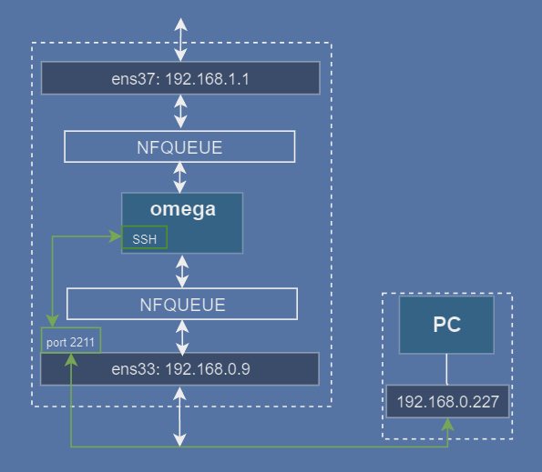  
 *Awaryjne połączenie omega z PC.*

 ---

>### TEST 4  
>**PC** - połączenie powinno przebiec pomyślnie:  
  > 1. `ssh -p 2211 192.168.0.9`  
  > 2. `ssh -p 2211 192.168.0.178` 
>  
>Wszystkie z poniższych powinny zakończyć się niepowodzeniem:  
>**PC:**  
  >1. `ping 192.168.0.9`  
  >2. `ssh 192.168.0.9`  
  >3. `ssh -p 2222 192.168.0.9`  
  >4. `curl 192.168.0.9`  
  >
>**omega**:  
  >1. `ping 192.168.0.227`  
  >2. `ping -I ens33 google.com`  
  >3. `ping -I ens37 192.168.1.2`  
  >4. `curl 192.168.1.2`  
  >
>**alfa**:  
  >1. `ping -I ens38 192.168.1.1`  
  >2. `ping -I ens38 192.168.0.227`  
  >3. `curl https://www.example.com`  
>  

---

#### [🔝 Powrót do menu głównego](#spis-treści)
---

## 5. *Suricata* 

### 5.1 Instalacja
Odsyłam do dokumentacji *Suricata* :  
[Instalacja *Suricata* ](https://docs.suricata.io/en/suricata-7.0.7/quickstart.html)

#### Konfiguracja:
Edytuj plik `/etc/suricata/suricata.yaml`:
```yaml
nfq:
  mode: accept
  repeat-mark: 1
  repeat-mask: 1
  route-queue: 2
  batchcount: 20
  fail-open: yes
runmode: workers
```

### 5.2 Suricata *inline*

Pakiet przychodzący z  interfejsu sieciowego lub pochodzący z maszyny lokalnej (***omega***) po przejściu przez łańcuch `INPUT` lub `OUTPUT` lub `FORWARD` zostaje przekazany do kolejki *NFQUEUE*.
*Suricata* w trybie inline może zaakceptować pakiet *NF_ACCEPT*, wówczas zostaje on zwrócony do łańcucha z którego trafił do *NFQUEUE* i rusza w dalszą podróż zgodnie z regułąmi iptables. *NF_DROP* porzuca pakiet i jego podróż kończy się. *Suricata* poza zablokowaniem pakietu może wysłać odpowiedź do nadawcy: TCP Reset lub komunikat ICMP, tę opcję możemy uruchomić w danej regule *Suricata*, o czym później.

 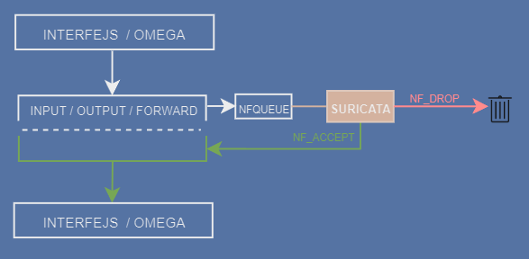  
 *Interakcja Suriacty z NFQUEUE*

---

Poniżej na schemacie interakcja *Suricata* wewnątrz serwera ***omega*** z każdym z  łańcuchów, w określonym kierunku. 

 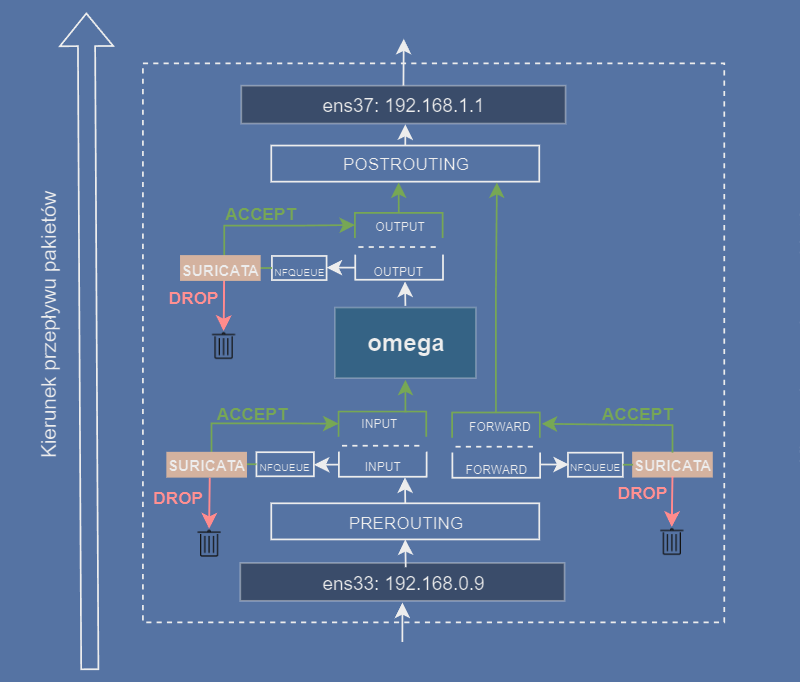  
 *Przepływ pakietów i Suricata*


>### TEST 5
>Powtórz wszystkie [testy NFQUEUE](#test-4), jednak tym razem każde polecenie powinno zakończyć się pomyślnie.

---
#### [🔝 Powrót do menu głównego](#spis-treści)
---

## 6. Reguły

Reguły emerging threats - jak zainstalować itd i dlaczego najlepiej tych używać a nie własnych. aktualizacja automatyczna reguł.

### 6.1 Własne reguły dla *Suricata* :

#### 1. Blokowanie `echo request`:  
  ```bash
  drop icmp 192.168.0.9 any -> 192.168.0.178 any (msg:"ICMP packet detected: Echo Request"; itype:8; classtype:policy-violation; sid:1; rev:1;)
  ```

#### 2. Blokowanie DNS dla `example.com`:
   ```bash
   drop dns 192.168.1.2 any -> any any (msg:"DNS query detected: example.com"; dns.query; content:"example.com"; nocase; sid:2; rev:1;)  
   ```

#### 3. Alert *SSH* do omega
  ```bash
  alert tcp any any -> 192.168.0.9 22 (msg:"Incoming SSH connection to omega port 22"; flow:to_server; flags:S,12; sid:3; rev:1;)
  ```

#### 4. Alert *SSH* do alfa
  ```bash
  alert tcp any any -> 192.168.1.2 22 (msg:"Incoming SSH connection to alfa port 22"; flow:to_server; flags:S,12; sid:4; rev:1;)
  ```

#### 5. Alert *HTTP* do alfa
  ```bash
  alert http any any -> 192.168.1.2 80 (msg:"Incoming http connection to alfa"; flow:to_server; flags:S,12; sid:5; rev:1;)
  ```

#### 6. Reject *TCP*
  ```bash
  reject tcp any any -> 192.168.0.9 23 (msg:"Incoming telnet connection to omega"; flow:to_server; flags:S,12; sid:6; rev:1;)
  ```

#### 7. Reject *ICMP*
  ```bash
  reject icmp 192.168.0.178 any -> 192.168.0.9 any (msg:"Incoming echo request - reject"; sid:7; rev:1;)
  ```

### 6.2 Dodaj reguły do testów

- zapisz powyższe reguły do pliku `/var/lib/suricata/rules/my.rules`
- w pliku konfiguracyjnym `/etc/suricata/suricata.yaml` odnajdź linijkę:  
`rule-files:` i dodaj plik `my.rules`.

# dodać zdjęcie yaml

---
#### [🔝 Powrót do menu głównego](#spis-treści)
---

## 7. Uruchomienie

Przed uruchomieniem dobrze jest zweryfikować poprawność konfiguracji pliku `suricata.yaml` i naszych reguł.

```bash
# Sprawdzenie konfiguracji Suricata
sudo suricata -c /etc/suricata/suricata.yaml -T
```

Uruchomienie w trybie IPS:

>
>```bash
>sudo suricata -c /etc/suricata/suricata.yaml -q 0
>```
>`-c` lokalizacja pliku konfiguracyjnego *Suricata*  
>`-T` test  
>`-q` tryb *NFQUEUE*  
>`0` numer kolejki *NFQUEUE* w iptables (domyślnie: `0`)  

---

Na poniższym schemacie  <span style="color:#B85920">kolorem</span> jest zanzaczona interakcja *Suricaty* z ruchem wewnątrz maszyny ***omega***. Cały ruch poza *"awaryjnym ssh (port 2211)"* jest monitorowany i przekazywany zgodnie z ustalonymi wcześniej regułami.

 

## 8. Weryfikacja

Przeprowadzimy testy weryfikujące poprzednio definiowane reguły.
Najpierw otwórz w drugim terminalu ***omega*** plik z logami *Suricata* : 
```bash
# pokaż ostatnie logi 
sudo tail -f /var/log/suricata/fast.log
```  

W komentarzu przy każdym teście jest napisana nazwa maszyny, z której wykonujemy polecenie i opis, komenda i zrzut ekranu z pliku `fast.log`

Test:

- dla [reguły 1](#1-blokowanie-echo-request):
  ```bash
    # omega: echo request do alfa po sieci zewnętrznej
    ping -I ens33 192.168.0.178 
    # połączenie powinno zostać zablokowane, drop:
  ```
  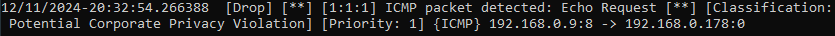  
  ---

- dla [reguły 2](#2-blokowanie-dns-dla-examplecom):
  ```bash
    # alfa: pobierz stronę przez interfejs ens38
    curl --interface ens38 https://www.example.com 
    # połączenie powinno zostać zablokowane, drop
  ```
  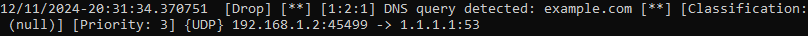  
  ---

- dla [reguły 3](#3-alert-ssh-do-omega):  
  ```bash
    # PC: połączenie ssh do omega
    ssh 192.168.0.9
    #połączenie zaakceptowane, alert:
  ```
    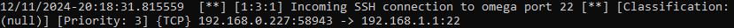  
  ---

- dla [reguły 4](#4-alert-ssh-do-alfa):  
  ```bash
    # PC: polaczenie ssh do alfa przez omega:
    ssh -p 2222 192.168.0.9
    # połączenie zaakceptowane, alert:
  ```
  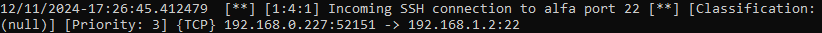  
  ---

- dla [reguły 5](#5-alert-http-do-alfa):  
  ```bash
    # PC: pobranie strony z alfa;
    curl 192.168.0.9
    # połączenie zaakceptowane, alert:
  ```
  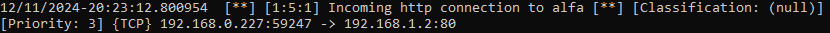  
  ---

- dla [reguły 6](#6-reject-tcp):   
  ```bash
    # PC: połączenie telnet do omega:
    telnet 192.168.0.9
    # połączenie zablokowane, reject:
  ```
  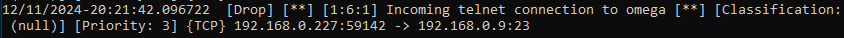  
  ---

- dla [reguły 7](#7-reject-icmp):  
  ```bash
    # alfa: icmp do omega po interfejsie zewnętrznym:
    ping -I ens33 192.168.0.9 
    # połączenie zablokowane, reject:
  ```
  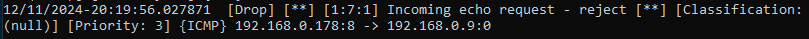  

---
#### [🔝 Powrót do menu głównego](#spis-treści)
---

## 9. Co może pójść nie tak

Pierwszą i główną oznaką, że "coś poszło nie tak" jest brak dostępu do Internetu, jak rónież brak połączenia pomiędzy maszynami wirtualnymi i ***PC*** lub zrywanie połączeń *SSH*.

### 9.1. Brak dostępu do Internetu - ***omega***

 Najczęściej miałem problem z połączeniem z Internetem główną przyczyną był autostart *Suricata* w trybie af-packet, w którym nie korzysta ona z kolejki *NFQUEUE*, w konsekwencji pakiety w niej giną. Rozwiązanie:
 ```bash
 sudo systemctl stop suricata
 sudo suricata -c /etc/suricata/suricata.yaml -q 0
 ```

 Zwróć szczególną uwagę na konfigurację pliku [`suricata.yaml`](#konfiguracja)
 
  ***Test 1:*** Z ***omega*** wykonaj polecenie: 

  ```bash
  ping google.com
  ``` 
w przypadku barku odpowiedzi prawdopodobnie *Suricata* nie jest uruchomiona.
Sprawdź: 
```bash
ps aux | grep "suricata"
```
powinien być aktywny proces:
```bash 
*Suricata* -c /etc/suricata/suricata.yaml -q 0
```
***Test 2:*** Jeżeli *Suricata* jest uruchomiona i nie ma odpowiedzi na echo request z ***omega***, sprawdź NAT na `omega
```bash
sudo ipables -t nat -vnL | grep "ens33"
```
jeżeli nie ma takiego wpisu, dodaj go:
```bash 
sudo iptables -t nat -A POSTROUTING -o ens33 -j MASQUERADE
```

---
#### [🔝 Powrót do menu głównego](#spis-treści)
---

### 9.2. Brak dostępu do Internetu -  ***alfa*** 

***Test 1:*** Sprawdź konfigurację  ***alfa*** i porównaj [tutaj](#22-maszyna-wirtualna-alfa).  

```bash
sudo netplan get
```

***Test 2*** Sprawdź czy reguły *Suricata* nie blokują ruchu: /var/log/suricata/fast.log.

***Test 3:*** Sprawdź w ***omega*** łańcuch `POSTROUTING` w tablicy NAT:
```bash
sudo iptables -t nat -vnL
```
rezultat powinien być podobny do:

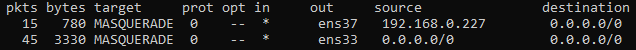

Jeżeli wpisu brakuje, wróć do [NAT na ***omega***](#network-address-translation-nat).  

 
### 9.3. Ruch nie trafia do *NFQUEUE*:

*omega* - wyświetl wpisy z iptables zawierające frazę "nfq":

   ```bash
   sudo iptables -vnL | grep -i "nfq"
   ```

W kolumnie pierwszej wyświetlana jest liczba pakietów skierowanych do kolejki:

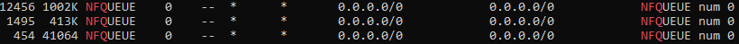  

jeżeli liczba pakietów jest `0`, sprawdź logi syslog:

  ```bash
  sudo tail -f /var/log/syslog
  ```
  szukaj wpisów `UFW BLOCK`, jeśli takie są, prawdopodobnie należy poprawić reguły iptables.

---
#### [🔝 Powrót do menu głównego](#spis-treści)
---

### 9.4 Awaria

Czasem wystęuje błąd podczas uruchomienia *Suricata* - system nie może zainicjalizować mechanizmu *NFQUEUE* - pozostaje restart ***omega***, ewentualne, aby zapewnić dostęp do sieci, należy usunąć reguły z iptables:  

```bash
# usun przekazywanie ruchu do kolejki NFQUEUEz łańcucha INPUT
iptables -D INPUT -j NFQUEUE;
# usun przekazywanie ruchu do kolejki NFQUEUEz łańcucha FORWARD
iptables -D FORWARD -j NFQUEUE;
# usun przekazywanie ruchu do kolejki NFQUEUEz łańcucha OUTPUT
iptables -D OUTPUT -j NFQUEUE;
```

---
#### [🔝 Powrót do menu głównego](#spis-treści)
---

### 9.5 Zrywanie połączeń *SSH*

Zamykanie połączeń *SSH* na portach `22` i `2222` w przypadku zatrzymania *Suricata* jest zachowaniem na jakim mi zależało. Jeżeli natomiast jest zamykane połączenia "awaryjne" to jest problem. Mój polegał na na "wpadaniu" pakietów do *NFQUEUE* podczas połączenia *SSH* na port `2211` do ***omega***. Gdy *Suricata* nie była uruchomiona, połączenie nie mogło być nawiązane lub po zatrzymaniu *Suricata* połączenie było zamykane. Rozwiązaniem było dodanie [reguł *INPUT* i *OUTPUT*](#awaryjne-ssh-na-omega).

## 10. Uwagi

- **mechanizm *NFQUEUE***  
po przekierowaniu ruchu do *NFQUEUE* połączenie z siecią bez uruchominej *Suricata* w trybie
*NFQUEUE* będzie niemożliwe - ruch sieciowy "utknie" w kolejce *NFQUEUE*. Także ruch *SSH*,     jeżeli nie skonfigurowałeś "awaryjnego ssh".

- **Ulotna konfiguracja iptables**  
  Po restarcie systemu wpisy z iptables zostają usunięte. Zachowaj konfigurację instalując:  
  ```bash
  apt install iptables-persistent
  ``` 

  lub korzystajac z wbudowanych narzędzi - zapis reguł do pliku:

  ```bash
  # zapisz bieżące reguły iptables do pliku
  sudo iptables-save > /etc/iptables/my.rules 
  ```

  wczytanie reguł po uruchomieniu systemu:  
  ```bash
  # wczytaj zapisane reguły z pliku do iptables
  sudo iptables-restore < /etc/iptables/my.rules
  ```
- [**Przekazywanie pakietów między interfejsami**](#konfiguracja-omega-jako-router) nie jest wymagane do pracy *Suricata* w trybie *NFQUEUE*, są przydatne do pracy systemu w razie awarii *Suricata* .

- [**Usunięcie wpisów**](#84-awaria) **z *NFQUEUE*** oznacza brak monitorowania ruchu przez *Suricata* 

 - Dodanie kolejnych urządzeń do monitoringu - urządzenie z bramą domyślną na `192.168.1.0/24` będzie monitorowane przez *Suricata*   

[comment]: <> (- Narzedzie `systemd` do automatycznego wczytywania reguł przy starcie:)

---
#### [🔝 Powrót do menu głównego](#spis-treści)
---
## 11. Podsumowanie


